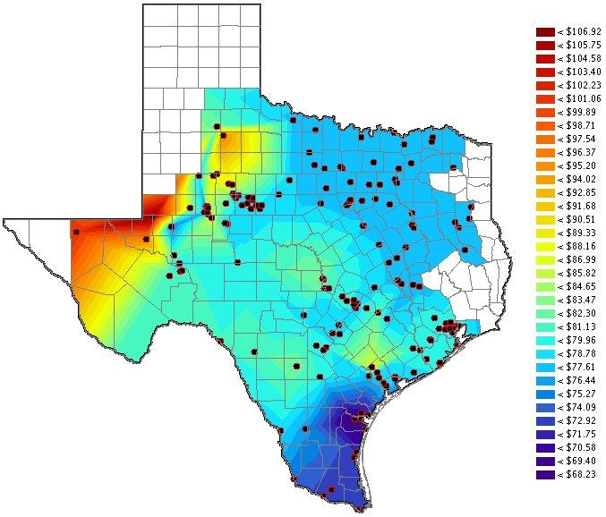

## Electricity Market

In Texas, although most of our electricity bills show a flat rate, the electricity retailers buy electricity from whole sale market at different prices. The prices normally vary with day, time and location.
<BR/>

<BR/>
The Shiny application demonstrates the differences of electricity prices between days of week and hours of day. 

## Prepare the data

The electricity price data are downloaded from <http://www.ercot.com>.

The prices are located at Market Information -> Market Prices -> DAM Settlement Point Prices.

- Downloads the last thirty days data in csv format.
- Read unzipped csf files into R.
- Subset the data by keeping data with settlement point name of HB_HUBAVG.
- Calculate the median prices group by day of the week and hour of the day.

Notes: HB_HUBAVG is ERCOT Hub Average 345kv Hub price which is considered as an ERCOT-wide price.

## ui.R : user picks the day

User can view the 24 hours' electricity prices by choosing the day of week (Sunday, Monday, Tuesday, etc.), then the curve will be updated.

```
shinyUI(fluidPage(
  sidebarLayout(
    sidebarPanel(
		selectInput("wDay", "Choose a day:", 
          choices = c('Sunday','Monday','Tuesday'
            ,'Wednesday','Thursday','Friday','Saturday'))
	),
    mainPanel(
      plotOutput("curvePlot")
    )
  )
))
```

## server.R : gets the day then plot curve
```{r, echo=FALSE}
myPrices <- read.table(header = TRUE, sep = ",", text = "
Day,Hour,Price
Friday,1,31.77
Friday,2,28.03
Friday,3,26.29
Friday,4,25.93
Friday,5,26.27
Friday,6,27.49
Friday,7,34.01
Friday,8,33.69
Friday,9,34.23
Friday,10,33.66
Friday,11,35.6
Friday,12,36.81
Friday,13,39.53
Friday,14,46.17
Friday,15,53.7
Friday,16,59.85
Friday,17,72.15
Friday,18,54.17
Friday,19,45.9
Friday,20,40.51
Friday,21,38.46
Friday,22,36.91
Friday,23,35.89
Friday,24,33.78
Monday,1,34.17
Monday,2,28.16
Monday,3,28.32
Monday,4,25.99
Monday,5,26.38
Monday,6,32.27
Monday,7,32.85
Monday,8,33.69
Monday,9,34.32
Monday,10,35.28
Monday,11,35.48
Monday,12,38.91
Monday,13,41.44
Monday,14,48.98
Monday,15,57.14
Monday,16,63.61
Monday,17,77.66
Monday,18,56.77
Monday,19,49.47
Monday,20,42.44
Monday,21,42.82
Monday,22,40.67
Monday,23,36.59
Monday,24,36.14
Saturday,1,36.43
Saturday,2,29.75
Saturday,3,29.18
Saturday,4,26.21
Saturday,5,25.45
Saturday,6,26.18
Saturday,7,29.8
Saturday,8,29.6
Saturday,9,31.5
Saturday,10,33.21
Saturday,11,33.87
Saturday,12,37.24
Saturday,13,41.81
Saturday,14,44.08
Saturday,15,53.39
Saturday,16,59.67
Saturday,17,70.69
Saturday,18,54.91
Saturday,19,49.79
Saturday,20,41.51
Saturday,21,39.42
Saturday,22,36.18
Saturday,23,35.35
Saturday,24,35
Sunday,1,34.49
Sunday,2,29.54
Sunday,3,28.81
Sunday,4,27.3
Sunday,5,25.31
Sunday,6,26.44
Sunday,7,28.99
Sunday,8,29.24
Sunday,9,30.25
Sunday,10,33.2
Sunday,11,34.52
Sunday,12,36.42
Sunday,13,41.71
Sunday,14,45.5
Sunday,15,54.48
Sunday,16,59.77
Sunday,17,69.26
Sunday,18,56.63
Sunday,19,52.86
Sunday,20,40.44
Sunday,21,39.07
Sunday,22,39.59
Sunday,23,35.35
Sunday,24,34.32
Thursday,1,33.345
Thursday,2,28.26
Thursday,3,28.285
Thursday,4,27.38
Thursday,5,27.515
Thursday,6,29.71
Thursday,7,31.18
Thursday,8,32.565
Thursday,9,33.095
Thursday,10,34.315
Thursday,11,35.395
Thursday,12,38.265
Thursday,13,40.485
Thursday,14,45.94
Thursday,15,53.67
Thursday,16,65.27
Thursday,17,74.135
Thursday,18,56.955
Thursday,19,46.955
Thursday,20,39.885
Thursday,21,40.26
Thursday,22,38.11
Thursday,23,37.615
Thursday,24,35.715
Tuesday,1,31.36
Tuesday,2,27.3
Tuesday,3,25.965
Tuesday,4,25.395
Tuesday,5,25.39
Tuesday,6,28.675
Tuesday,7,32.045
Tuesday,8,32.45
Tuesday,9,33.775
Tuesday,10,34.435
Tuesday,11,36.12
Tuesday,12,36.505
Tuesday,13,40.425
Tuesday,14,43.675
Tuesday,15,52.055
Tuesday,16,62.53
Tuesday,17,70.985
Tuesday,18,57.115
Tuesday,19,47.755
Tuesday,20,42.125
Tuesday,21,39.09
Tuesday,22,37.875
Tuesday,23,36.69
Tuesday,24,34.86
Wednesday,1,30.655
Wednesday,2,26.13
Wednesday,3,25.725
Wednesday,4,25.06
Wednesday,5,25.25
Wednesday,6,26.86
Wednesday,7,32.475
Wednesday,8,32.825
Wednesday,9,33.31
Wednesday,10,34.28
Wednesday,11,35.995
Wednesday,12,38.24
Wednesday,13,43.725
Wednesday,14,48.23
Wednesday,15,58.05
Wednesday,16,64.57
Wednesday,17,75.265
Wednesday,18,56.97
Wednesday,19,52.34
Wednesday,20,44.695
Wednesday,21,43.165
Wednesday,22,39.175
Wednesday,23,35.675
Wednesday,24,35.41
")
selectedDay <- 'Wednesday' # actually codes use input$wDay
data <- subset(myPrices, Day == selectedDay)
title <- paste0(selectedDay, '\'s Hourly Median Electricity Prices in Texas')
```
```{r, echo=TRUE}
plot(data$Hour, data$Price, type = "l", main = title, xlab = "Hour",
     ylab = "Price ($/MWh)", col = "red", lwd = 5, xaxt="n")
axis(1, at = seq(1, 24, by = 1), las=2)
grid()
```
